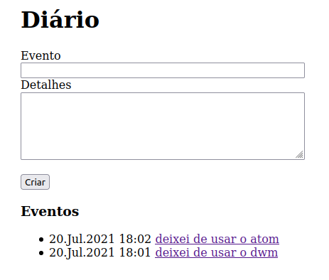

# Diário

Pequeno diário com banco em SQLite.

## Tela principal



## Instalação

O diário roda diretamente em qualquer diretório ou através do server built-in:

```bash
php -S localhost:8080 index.php
```
